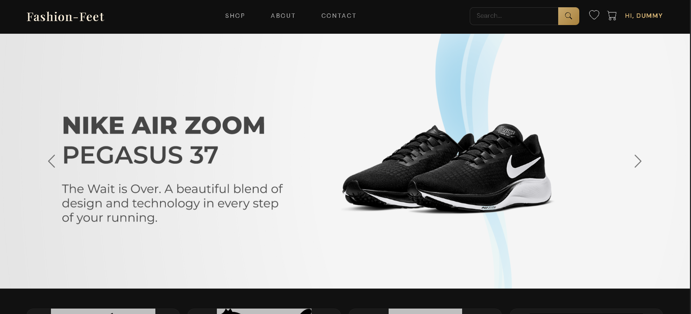
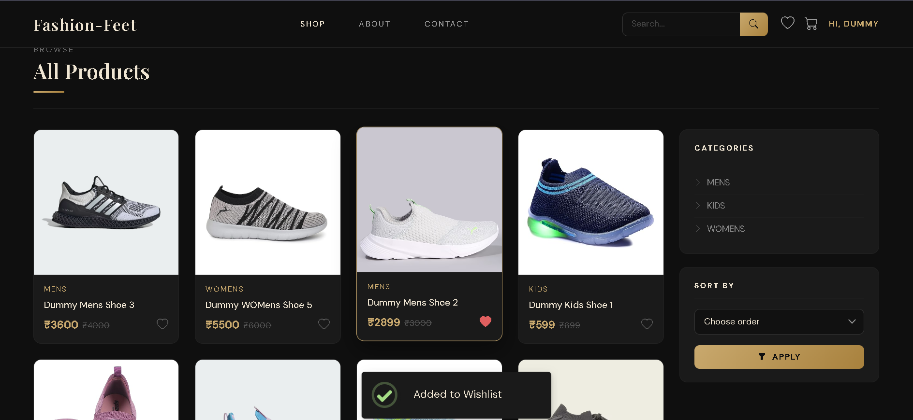
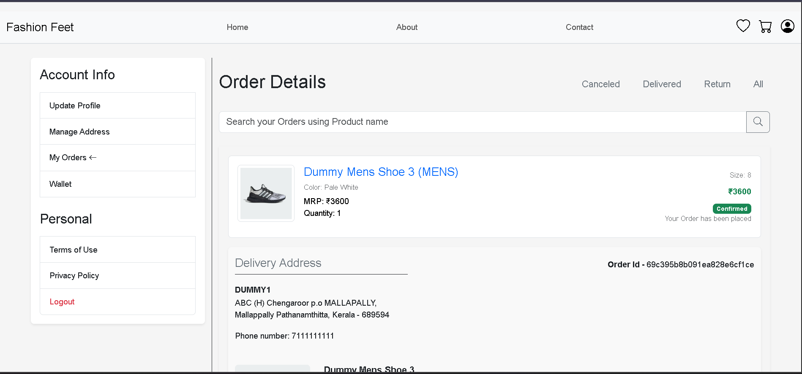
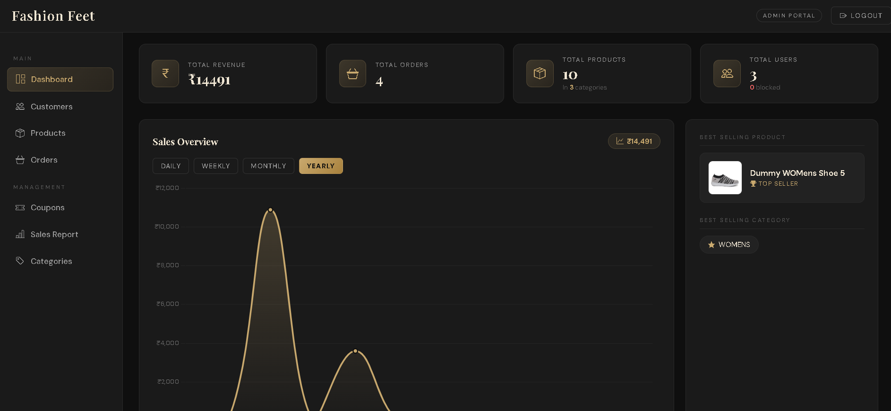
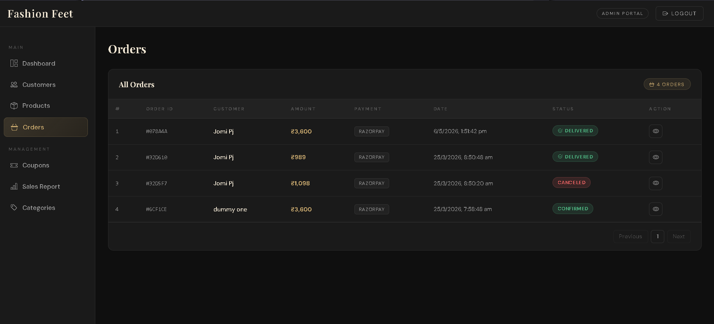

# Fashion Feet

Fashion Feet is a full-stack e-commerce application focused on online shoe purchasing, secure checkout systems, and admin-controlled product management.

The platform provides seamless shopping experiences for users while offering powerful management tools for administrators.

---

# Features

## User Features

- Browse products without authentication
- Search and explore shoe collections
- Add products to cart and wishlist
- Manage multiple delivery addresses
- Secure online payment workflow
- Apply coupons and wallet balances
- OTP-based authentication
- Google Authentication login

---

## Admin Features

- Add, edit, and manage products
- Manage product categories
- Control coupons and offers
- Manage user accounts
- Update order statuses
- View sales reports and analytics
- Export reports as PDFs

---

# Technical Highlights

- Session-Based Authentication
- OTP Verification System
- Razorpay Payment Integration
- Wallet and Refund Workflows
- Coupon Management System
- Category-Based Offers
- Automated Tasks using Cron Jobs
- AWS EC2 + Nginx Deployment

---

# Tech Stack

## Frontend
- EJS
- HTML
- CSS
- JavaScript

## Backend
- Node.js
- Express.js

## Database
- MongoDB

## Services & Tools
- Razorpay
- Nodemailer
- Cron Jobs
- AWS EC2
- Nginx

---


# Screenshots

## Home Page



---

## Product Page



---

## OrderHistory Page



---

## Admin Dashboard



---

## Order Managment Page



---


# Installation

## Clone Repository

```bash
git clone https://github.com/jomi087/E-commerce-Shoes-1st.git
```

---

## Install Dependencies

```bash
npm install
```

---

## Run Project

```bash
npm start
```

---

# Environment Variables

Create a `.env` file in the root folder.

```env
PORT=
MONGO_URI=
SESSION_SECRET=
RAZORPAY_KEY_ID=
RAZORPAY_SECRET=
EMAIL_USER=
EMAIL_PASS=
GOOGLE_CLIENT_ID=
GOOGLE_CLIENT_SECRET=
```

---

# Security Features

- Session-based authentication
- OTP verification
- Secure payment workflow
- Protected admin routes
- Refund and wallet handling

---

# Deployment

The application was deployed using:

- AWS EC2
- Nginx Reverse Proxy

---

# Learning Outcomes

This project helped improve knowledge in:

- e-commerce workflow management
- sync & asyn api call
- req res lyfe cycle
- dom manupulation
- secure payment integration
- coupon and wallet systems
- backend mvc architecture
- deployment and hosting practices
- admin dashboard management

---

# Author
jomi